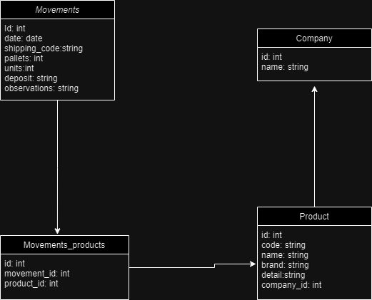

# Requisitos
- Instalar [MySQL](https://dev.mysql.com/downloads/mysql/)
- Instalar go 1.21+
- Instalar Node 16.20+

# Levantar el proyecto
- Crear una base de datos con el nombre `stock_controller`
- crear archivo .env en la carpeta client con la siguiente estructura:
```
DB_USER=<tu_user>:<tu_pass>
DB_HOST=tu_host
DB_PORT=tu_port
DB_NAME=nombre_tu_db
```
- En windows se puede ejecutar el archivo `init.bat` que levanta automaticamente el proyecto
- Sino se puede levantar con una terminal en la carpeta `client` ejecutando el comando `npm start` y una terminal en la carpeta `server` ejecutando el comando `go run ./main.go`

# DER

